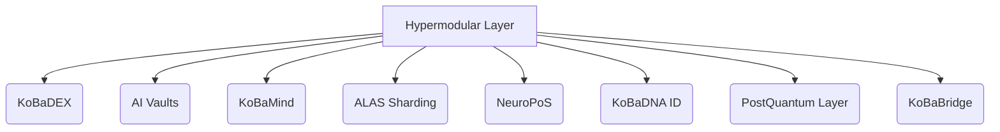

# KoBaChain  
**Quantum-Resistant. AI-Native. Hypermodular Web3 Infrastructure.**

---

> “We are not upgrading the Web3.  
> We are **replacing** it.”

---

## About the Project

**KoBaChain** is not just another blockchain.  
It is a hypermodular, post-quantum, and AI-native network built for the future.

A network that scales by itself.  
A DAO that learns from failure.  
A token integrated into every module.  
Cryptography built to withstand 2030 and beyond.

Core innovations:
- **ALAS** — AI-based sharding that dynamically grows and contracts with load
- **NeuroPoS** — a consensus protocol that evaluates validators based on behavior and reputation
- **KoBaDNA** — zk-STARK-based ID and soulbound reputation with zero KYC
- **KoBaMind** — an AI-powered DAO where intelligence amplifies governance
- **PostQuantum Layer** — next-gen quantum-resistant security (Dilithium, Falcon)

---

## Architecture (Hypermodular Core)

Each module:
- Can be upgraded without hard forks
- Operates independently, but integrates via DAO and AI
- Adapts in real time to network load and user activity

---

## Roadmap

| Phase                | Period       | Milestone                              |
|----------------------|--------------|----------------------------------------|
| KBCH Token Launch  | Q3–Q4 2025   | Arbitrum + BNB deployment, LayerZero bridge |
| KoBaDEX MVP        | Q3–Q4 2025   | DEX launch, listings, landing page     |
| AI Vaults          | Q1–Q3 2026   | Adaptive DeFi strategies, KoBaMind beta |
| Full Network       | 2027–2028    | NeuroPoS, zkBridge, PostQuantum Layer  |

---

## KBCH Token

**KBCH** is a multichain token (Arbitrum + BNB) embedded into every layer of KoBaChain:

- Powers governance via KoBaMind (AI DAO)
- Required as `gas` for all execution environments
- Used to launch modular subnets and smart modules
- Acts as a cryptographic anchor in zk-based identity (KoBaDNA)

📌 **Tokenomics, vesting, and DAO allocations will be released prior to TGE.**

---

## Documentation

- 📙 [Manifesto](./docs/manifesto.pdf)

_More languages and developer docs coming soon._

---

## Development Status

- ✅ Architecture design complete  
- ✅ Public documents published  
- 🛡 Smart contract drafts submitted for third-party security audit  
- 🔜 Testnet deployment and bridge layer integration in progress  
- 🔒 Core modules held under NDA until audit completion  

---

## Get Involved

**KoBaChain has been in development since 2018.**  
> KoBaChain is not just code — it is **intellectual property**, backed by patent filings under WIPO/PCT.

Strategic partnerships, investment opportunities, and early-stage technical documentation are available under NDA.

Contact: `partners@kobachain.com`.

---

## License

**Unlicensed (pre-release)**  
Use, modification, and redistribution without permission are prohibited.

---

> This is not a fork.  
> This is not another L1.  
> **This is survival tech.**
